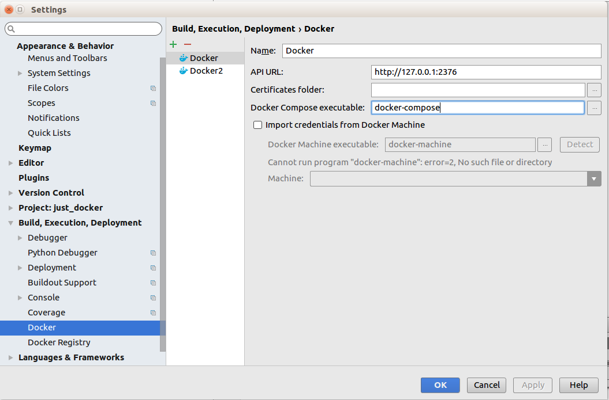

## Why

As I really really appreciate it that we can have an `isolated` development environment, when I heard [`pycharm` can debug with docker](https://blog.jetbrains.com/pycharm/2015/10/announcing-pycharm-5-eap-143-165-docker-integration/), I was more than happy. However, things are not that easy.

<!-- more -->

## What I got

I tried, tried and tried. At an amazing moment, I succeeded running docker on windows through DockerToolbox. Mostly, I refer [One answer to Running a Docker image in PyCharm causes ¡°Invalid volume specification¡±](http://stackoverflow.com/a/39968174/7067150). (By the way, my machine and environment is exactly like the answer)

BUT suddenly I failed to repeat it.

## So I changed to try it on ubuntu

Unbuntu 14.04 in Virtualbox. The default settings when adding docker as shown in fig @fig:add_docker_linux is not suitable for Ubuntu 14.

{#fig:add_docker_linux width=70%}


According to [another SO question's answer](http://stackoverflow.com/a/39971120/7067150), adding `unix:///var/run/docker.sock` to the `API URL` shows `Connection successful` when click `Apply`. But when running programs it still won't work.


## And then

Problem partially solved, when we use Docker to debug our project through PyCharm, it's not `attach` to a running docker and/or `exec` the commands (by now). Instead, it starts a new `Containner` and runs the commands, so if we want to debug a python file, we should make sure the docker running `python` when open. 

In other words, the `Dockerfile` better with the last sentence:

``` Dockerfile
CMD ["python3"]
```

And in Linux (Ubuntu) when this assured, all things are OK. And now I can debug with [`alpine-python`](https://github.com/Tsutomu-KKE/alpine-python/blob/master/jupyter/Dockerfile)

## TODO

After succeeding in Linux, I go back and try in windows, it's surely a bug of Pycharm and hope can be solved in a later version.

And what's more, what I really want is more than this, I hope as below:

``` vi

+------------------------------+
|                              |                  +------------------+    +-------------------+
|                              | <----------------+                  |    |                   |
|      Docker/rkt/others       |                  |    Desktop UI    XXXXXX     Happy ME      |
|                              +----------------> |                  |    |                   |
|                              |                  +------------------+    +-------------------+
+------------------------------+
      Some remote servers

```

In other words, no applications on PC/Desktop, no more reinstall systems, no different configurations, no more `configurations problems`! But with full control over what we use.

I will review related techs in the future, and this is another weekend I spent `play` with docker and all the configurations and DIT NOTHING WORTHFUL. Well, that's typical me. -.-
