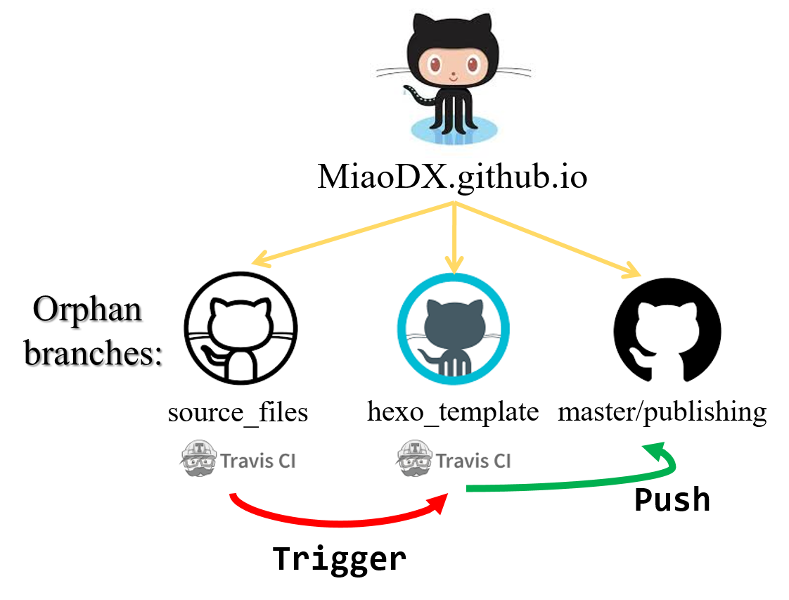
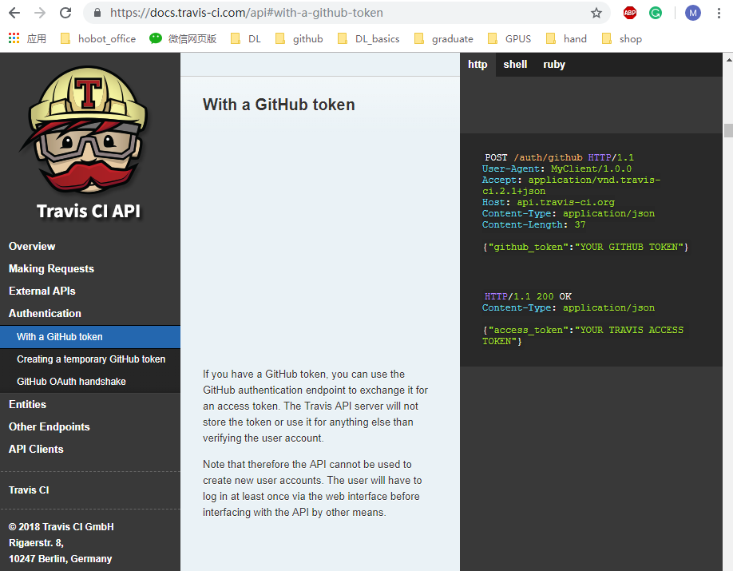
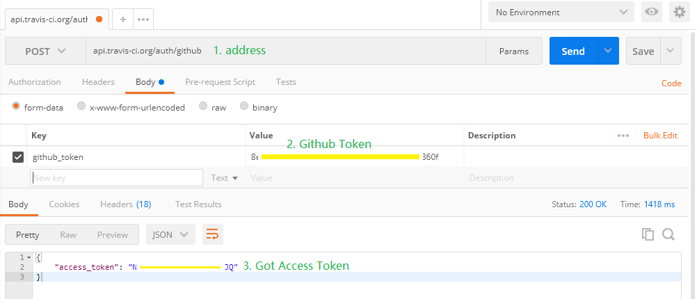

Configurations of my hexo blog, now rendering with pandoc and automatic building/publishing with Travis-CI.

<!-- more -->

## Features

* Automatic build by Travis-CI
* Image/equation numbering and reference
    - [hexo-renderer-pandoc](https://github.com/wzpan/hexo-renderer-pandoc)
    - [pandoc-fignos](https://github.com/tomduck/pandoc-fignos)
    - [pandoc-eqnos](https://github.com/tomduck/pandoc-eqnos)
* Wiki-Style tooltip reference
    - ~~[hexo-reference](https://github.com/kchen0x/hexo-reference)~~, seems not working

## Automatic build and publish by Travis-CI

It has been one long-time wish to build and publish blog automatically, may dates from the very first time meeting hexo. See [^ci_1], [^ci_2], [^ci_3], and maybe many more online for references.

[^ci_1]: https://segmentfault.com/a/1190000009054888
[^ci_2]: http://www.yanglangjing.com/2018/08/28/travis_ci_auto_deploy_hexo_to_vps/
[^ci_3]: https://notes.iissnan.com/2016/publishing-github-pages-with-travis-ci/

For many of them, two branches/repository are used, one for `hexo+blog source`, the other for `publishing`. We divide the first one, and the system is like in Fig @fig:hexo_sys. The main advantage is that the source files are totally independent with hexo.

{#fig:hexo_sys width=85%}

There are three `orphan` branches in this repository, `source_files` is all the blog source files and corresponding resources (images in most cases), `hexo_template` for the hexo configurations, and `master` for published blog html files.

`orphan` branches serves it well to separate these branches without specific dependences between each other, as in Fig @fig:hexo_sys, `source_files` and `hexo_template` are both equipped with travis-ci, the former one just trigger the latter after new commits.

So the majority of jobs are done at [`hexo_template` CI](https://github.com/MiaoDX/MiaoDX.github.io/blob/hexo_template/.travis.yml):

* Install necessary libraries, `hexo_cli`, `pandoc v2.x` and pandoc filters `pandoc-fignos, pandoc-fignos`, etc
* NPM installation for [`package.json`](https://github.com/MiaoDX/MiaoDX.github.io/blob/hexo_template/package.json)
* Get blog source files from `source_file` branch
* Get theme files & override the theme configuration
* Duplicate resources/images folder [by shell](https://github.com/MiaoDX/MiaoDX.github.io/blob/hexo_template/move_ims.sh), this is due to the mechanism of hexo for serving images in the same-name folder of markdown files.
* hexo clean, hexo g
* Go to `./public` directory, `git init/add/commit`, `git push` to `master` branch
* Done!

As for the trigger procedure of [`source_files` CI](https://github.com/MiaoDX/MiaoDX.github.io/blob/source_files/.travis.yml), there are two similar code snippets for this task, see [stephanmg/travis-dependent-builds](https://github.com/stephanmg/travis-dependent-builds) and [plume-lib/trigger-travis](https://github.com/plume-lib/trigger-travis). The former one only use `Github Token` (we already have it at the `hexo_template` pushing part) and login travis to get the `Access Token` and do the trigger, the latter one requires `Access Token` as input, but have smaller processing time.

See [^tokens] for the differences between different types of tokens, and as shown in the bottom of it, we can get `Access Token` with `Github Token` with http requests (which is neat since we may not have ruby environments at hand) as shown in Fig @fig:get_token and send the requests with postman as in Fig @fig:get_token_postman.

That's it, we have setup the automatic updating blog system.

{#fig:get_token width=75%}

{#fig:get_token_postman width=75%}

[^tokens]: https://blog.travis-ci.com/2013-01-28-token-token-token

## Pandoc

The default markdown rendering engine is [`hexo-renderer-marked`](https://github.com/hexojs/hexo-renderer-marked), however, it performs poorly for images rendering, like specify the image width and numbering for reference, we choose `hexo-renderer-pandoc` instead.

With pandoc filter `pandoc-fignos`, we can specify image width and refer to images like:

``` vi
Please see figure @fig:answer_is_42 for more info.

[...]

{#fig:answer_is_42 width=85%}
```

### Pandoc version

The `hexo-renderer-pandoc` changed its behavior at version 2.x, as discussed in [^hexo_pandoc], chances are that we can change some codes by ourself to make it work, but we choose to install the newer version of pandoc with `sudo dpkg -i`

[^hexo_pandoc]: https://github.com/wzpan/hexo-renderer-pandoc/pull/22


## Drawbacks & workaround

### `---` un-support

When render file with many `---` for dividing line, hexo failed in one way or another.

So change `---` to `***` and done this forever :(

## TODO

- [ ] Compress the contents by `gulp` to make the rendering faster?