在 windows 上编译安装 opencv2 以及 opencv3，同时配置 python2 与 python3。预期目标是能够同时使用 python2/3 与 opencv2/3，共三种组合方式（opencv2 不支持 python3.x 版本）。

<!-- more -->

Linux，macOS，Raspberry Pi 等其他平台上的 opencv 安装请在 [OpenCV 3 Tutorials, Resources, and Guides](http://www.pyimagesearch.com/opencv-tutorials-resources-guides/) 寻找合适的方法，本文很大程度上参考了系列中的 [Ubuntu 16.04: How to install OpenCV](http://www.pyimagesearch.com/2016/10/24/ubuntu-16-04-how-to-install-opencv/)，甚至可以说是其在 windows 上的移植。

## Step 0.Goal

这里假设我们想要把 opencv 安装到 `C:\tools\opencv_all_in_one`，也就是分别是 `C:\tools\opencv_all_in_one\opencv2` 与 `C:\tools\opencv_all_in_one\opencv3`，最终希望与直接从官网下载解压下来的内容相似，就像是：


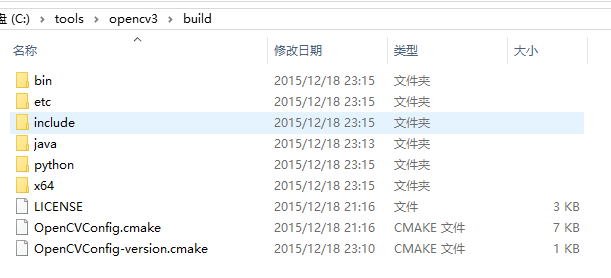

且同时支持 python2 与 python3。


## Step 1.Requirements

* Win10 [win7 应该也可以，没有做测试]
* VS2015 community [Free 的 community 版本，Long live Microsoft -.-]
* cmake
* git
* python2 and/or python3

Note：安装后三项时建议使用 [`choco`](http://chocolatey.org/) 安装，可以自动添加 PATH，另外使用命令行会减少不少截图工作。

**下面命令，如无特别说明建议在 git 提供的命令行窗口 -- 左上角有 MINGW64 的那个窗口执行：**

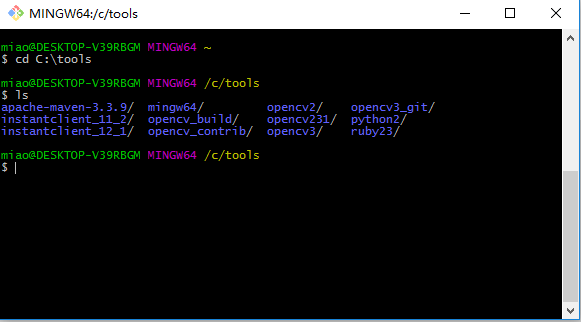


``` vi
# 确保所需软件
$ pwd
# c/tools

$ which python
# /c/Python36/python

$ which cmake
# /c/Program Files/CMake/bin/cmake

$ which git
# /mingw64/bin/git
```

另外，我的 python2 安装在了 `C:\tools\python2` 中（choco 自动选择了此目录），**请确保 python2/3 均安装了 `numpy`**（`pip install numpy`）。

## Step 2.Get opencv from github

``` vi
$ pwd
# /c/tools
$ git clone https://github.com/opencv/opencv.git opencv_git
# [...]
$ git clone https://github.com/opencv/opencv_contrib.git opencv_contrib
# [...]
```

其中 `opencv_contrib` 是因为 opencv3 中把许多 `Non-free` 模块放在了里面（比如著名的 `SIFT`,`SURF` 等），另外还有一些目前并不太成熟的新算法也都在里面，我们在编译 opencv3 时需要使用它。

## Step 3. 编译 opencv2

### 3.1. 切换到合适的版本

**查看可以选择的版本，在输入 `git checkout` 后按 `TAB` 建**：

``` vi
$ pwd
# /c/tools
$ cd opencv_git
$ git checkout
Display all 58 possibilities? (y or n)
2.2                    2.4.10                 2.4.12                 2.4.2                  2.4.4-beta             2.4.6.2r3              2.4.8                  3.0.0                  3.1.0                  origin/2.4
2.3.0                  2.4.10.1               2.4.12.1               2.4.3                  2.4.5                  2.4.6.2-rc1            2.4.8.1                3.0.0-alpha            3.2.0                  origin/HEAD
2.3.1                  2.4.10.2               2.4.12.2               2.4.3.1                2.4.6                  2.4.7                  2.4.8.2                3.0.0-beta             3.2.0-rc               origin/master
2.4                    2.4.10.3               2.4.12.3               2.4.3.2                2.4.6.1                2.4.7.1                2.4.8.3                3.0.0-rc1              HEAD                   tags/2.4.13.2
2.4.0                  2.4.10.4               2.4.13                 2.4.3-rc               2.4.6.2                2.4.7.2                2.4.9                  3.0-ocl-tech-preview   heads/2.4.13.2
2.4.1                  2.4.11                 2.4.13.1               2.4.4                  2.4.6.2r2              2.4.7-rc1              2.4.9.1                3.0-ocl-tp2            master


```

``` vi
# 选择 2.4.x 中最新的版本
$ pwd
# /c/tools/opencv_git
$ git checkout 2.4.13
Checking out files: 100% (5476/5476), done.
Previous HEAD position was 70bbf17... OpenCV Version++
HEAD is now at 59975db... Merge pull request #6441 from asmorkalov:version++
```

### 3.2. 进行编译配置

我们上面的 `opencv_git` 文件夹仅用于存储官方的文件，下面新建一个临时文件进行编译：

``` vi
$ pwd
# /c/tools

$ mkdir opencv_build_v2_tmp # 新建用于编译 opencv2 的文件夹
$ cd opencv_build_v2_tmp/
$ cmake-gui # 打开 cmake-gui 界面
```

**将 `opencv_git\CMakeLists.txt` 拖入界面**:

**Note:我的截图中 opencv 是在 opencv3_git 文件夹下，请原谅**

1.更改目标路径

2.点击 `Configure`

3.确保生成器合适

4.点击 `Finish`

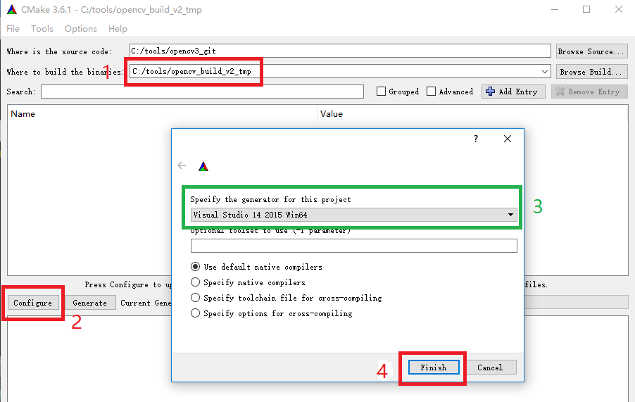

会自动生成配置文件，另打开一个 git-shell：

```vi
$ pwd
# opencv_build_v2_tmp/

$ ls
3rdparty/                cvconfig.h  OpenCVConfig.cmake
apps/                    data/       OpenCVConfig-version.cmake
cmake_uninstall.cmake    doc/        unix-install/
CMakeCache.txt           include/    version_string.tmp
CMakeFiles/              junk/       win-install/
CPackConfig.cmake        modules/
CPackSourceConfig.cmake  opencv2/
```

此时的截图如下：

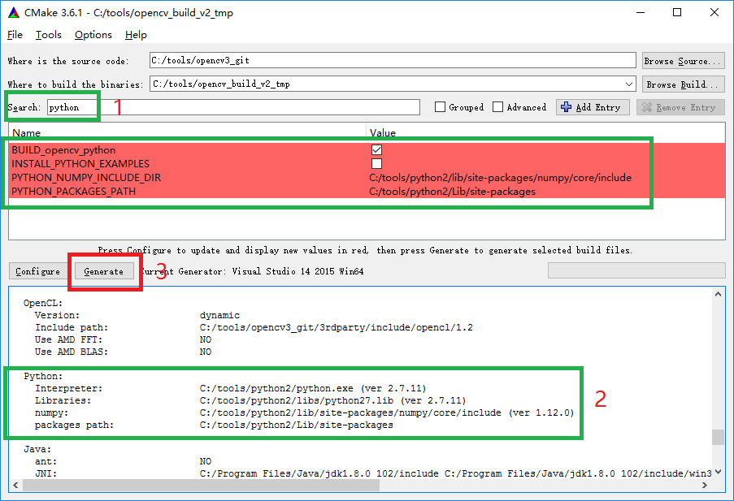

* 在 `Search` 框搜索 `python` 确保 python 被正确找到
* 也可在下面的输出结果中查找 `python` 项

然后，点击 `Generate`，会发现下面的输出框最后一行出现：

``` vi
Generating done
```

### 3.3. 编译

之后，我们就可以编译了，（双击）打开 `opencv_build_v2_tmp` 中的 `OpenCV.sln`，是一个熟悉的 VS 工程：

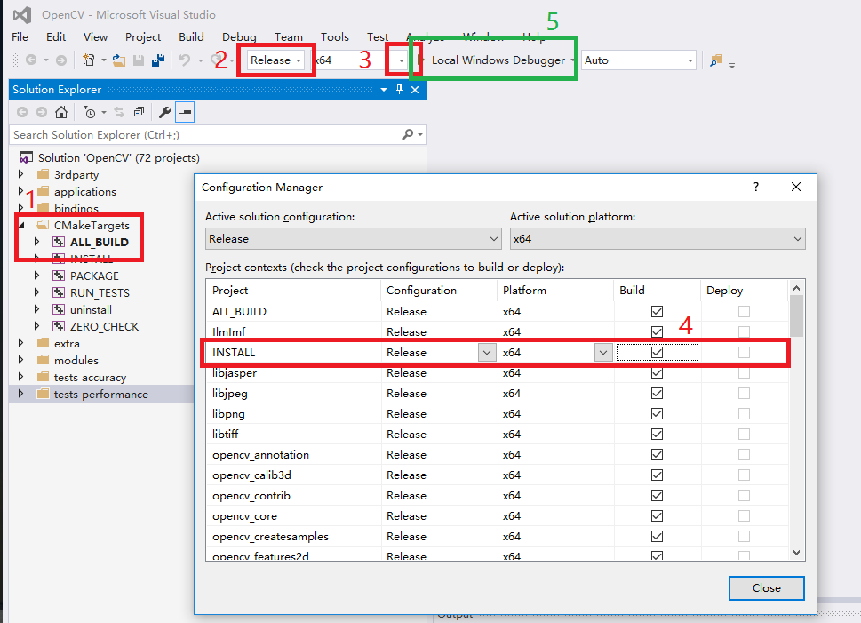

其中：

1.`CMakeTargets` 保持默认 `ALL_BUILD` 即好

2.选择 `Release` 与 `x64` 版本

3.点击 `x64` 右侧的下拉框

4.出现的窗口中第三项 `INSTALL` 的 `Build` 默认是没有勾选的，**将其勾选**

之后，等一段时间（编译阶段 CPU 占用会很高）

编译结果为：

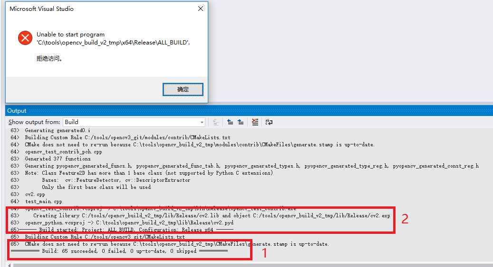

不必在意提示的错误，这是因为我们编译后并没有可运行的文件

1.输出框最后指示出全部编译成功！！

2.`cv2.lib` 即为 python2.x 需要的

上面也可以选择不进行 `INSTALL`，在编译结束后可以另外安装，此时可以将 `CMakeTargets` 中的 `INSTALL` 右键设置为 `Set as StartUp Project`，运行，瞬间结束，输出很好地指示我们安装在了哪里：

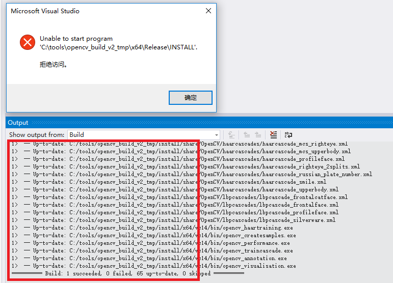

### 3.4. 整合编译结果

此时，`C:\tools\opencv_build_v2_tmp\bin\Release` 包含了一些例子的可执行文件，还有许多的 `dll` 文件，`C:\tools\opencv_build_v2_tmp\lib\Release` 中包含了我们需要的库。

但，我们**几乎只需要** `C:\tools\opencv_build_v2_tmp\install` 中的文件即可：

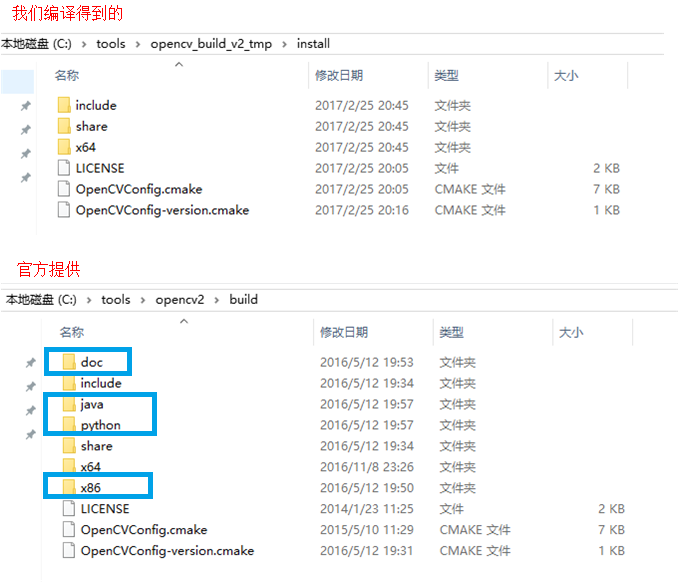

与官方提供版本相比，少了一些东西，需要注意的是我们前面说到的 python 使用，这里并没有，但编译结束时确实生成了，所以我们自己将其取出来：

新建 `python\2.7\x64` 的三层文件夹，将 `C:\tools\opencv_build_v2_tmp\lib\Release\cv2.pyd` 复制到 `C:\tools\opencv_build_v2_tmp\install\python\2.7\x64` 中。

### 3.5. 配置编译环境


#### 复制需要的文件

``` vi
$ pwd
# /c/tools

$ mkdir opencv_all_in_one
$ cd opencv_all_in_one/
$ mkdir opencv2
$ cd opencv2

# 将 install 文件夹下所有文件复制到 opencv2 文件夹下
$ cp c:/tools/opencv_build_v2_tmp/install/* -rf .
```

将 install 文件夹下所有文件复制到 opencv2 文件夹下，此时我们可以直接删除 `c:/tools/opencv_build_v2_tmp` 整个文件夹了，我们只需要 `C:\tools\opencv_all_in_one\opencv2` 文件夹内的内容。

#### 配置 PATH 路径

这里参考 [CMake 简介和 CMake 模板](http://tangzx.qiniudn.com/post-0100-cmake-templates.html) 来验证，其中 [OpenCV 的配置可以参考同一作者写的教程](https://github.com/district10/cmake-templates/issues/4)：

```
# copy and change from https://github.com/district10/cmake-templates/issues/4

set these two proper environment variables:
* OpenCV2_DIR -> C:\tools\opencv_all_in_one\opencv2
* OpenCV3_DIR -> C:\tools\opencv_all_in_one\opencv3 # 此文件夹我们待会儿编译 opencv3 时会生成
* OpenCV_DIR -> %OpenCV2_DIR% or %OpenCV3_DIR% (which you prefer)
add to PATH:
* %OpenCV2_DIR%\x64\vc10\bin 
* %OpenCV3_DIR%\x64\vc14\bin 
```

**Update 20170410:** 根据需要更改 `vc10` 或者是 `vc14`。

### 3.6. 验证编译、配置无误

在使用原作者提供的 CmakeLists 时**请确保使用 cmake-gui 来保证我们是生成合适的目标**，即：

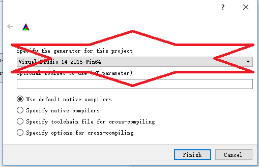

确保是生成 `Visual Studio 14 2015 Win64` 的工程（这也是刚我们编译 OpenCV 时选用的配置）。

直接使用 cmake 很可能会出错：

``` vi
$ pwd
# example_opencv
$ mkdir build
$ cd build
$ cmake ..
```

会得到：

``` vi
[...]
-- OpenCV ARCH: x86
-- OpenCV RUNTIME: vc14
-- OpenCV STATIC: OFF
CMake Warning at C:/tools/opencv_all_in_one/opencv2/OpenCVConfig.cmake:163 (message):
  Found OpenCV Windows Pack but it has not binaries compatible with your
  configuration.

  You should manually point CMake variable OpenCV_DIR to your build of OpenCV
  library.
Call Stack (most recent call first):
  CMakeLists.txt:11 (include)
[...]
```

很明显，它默认选择的 OpenCV ARCH 是 x86，而我们需要的是 x64，所以，为减少不必要的麻烦请使用 cmake-gui。


## Step 4. OpenCV3 的编译

编译 OpenCV3 与上面的步骤很相似，不过要将之前提到的 `opencv_contrib` 模块用上。

### 4.1. 选取合适的版本

```
$ pwd
# /c/tools

# 选取合适的 opencv 版本
$ cd opencv_git
$ git checkout 3.2.0

# Checking out files: 100% (5476/5476), done.
# Previous HEAD position was 59975db... Merge pull request #6441 from asmorkalov:version++
# HEAD is now at 70bbf17... OpenCV Version++

# 选取对应的 contrib 版本
$ cd ../opencv_contrib/
$ git checkout 3.2.0
# HEAD is now at 8634252... Merge pull request #701 from LaurentBerger:DericheFilter

$ cd ..
$ pwd
# /c/tools
$ mkdir opencv_build_v3_tmp
$ cd opencv_build_v3_tmp
$ cmake-gui .
```


请确保 `contrib` 模块与 `opencv3` 的**版本相同**，不然很可能出现一些问题。

### 4.2. 验证 python 版本

首先确保 python 版本没有问题，在 `Search` 框内搜索 `python` 会得到类似于下面的结果：

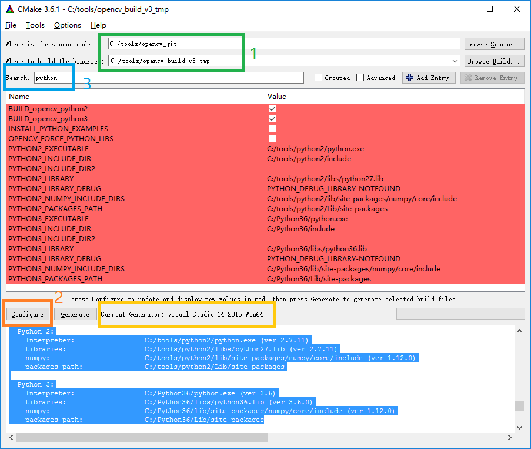

可以看出自动检测到了 python2 与 python3 的路径，这样便会生成两者的 binding。

### 4.3. 添加 `contrib` 库

此时需要将 `contrib` 加入进来，在 `Search` 框内输入 `extra`，将对应路径填入右侧空格，需要注意的是填入的是 `C:/tools/opencv_contrib/modules` 而不是 `C:/tools/opencv_contrib` （前者多了 `modules` 目录）：

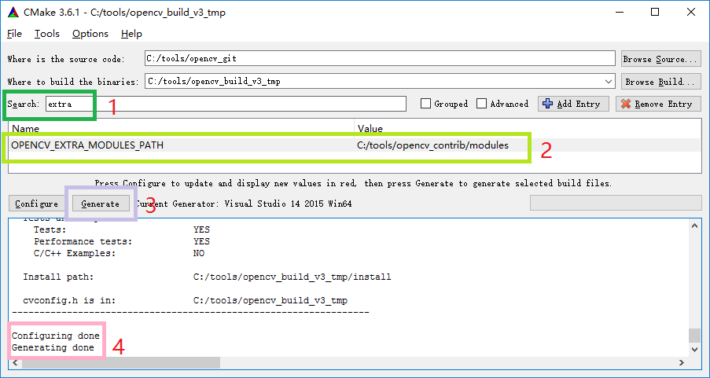

### 4.4. 整理编译得到的内容

之后便是编译了，与上面没有什么不同，这里看一下最终得到的 `install` 文件夹内的内容：

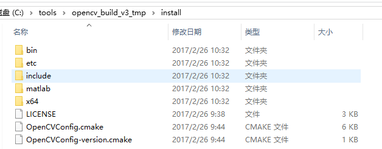

还是没有我们想要的 `python` 文件夹，与上面类似，新建 `python\2.7\x64` 的三层文件夹，将 `C:\tools\opencv_build_v3_tmp\lib\Release\cv2.pyd` 复制到 `C:\tools\opencv_build_v3_tmp\install\python\2.7\x64` 中，类外，我们一直说的 `python3` 支持还没有做到，会发现 `C:\tools\opencv_build_v3_tmp\lib\python3\Release` 文件夹内有一 `cv2.cp36-win_amd64.pyd` 文件，这便是 python3 对应的 `cv2.pyd`，将其复制到新建的
`C:\tools\opencv_build_v3_tmp\install\python\3.6\x64` 文件夹下。


将整个 `C:\tools\opencv_build_v3_tmp\install` 文件夹内容复制到 `C:\tools\opencv_all_in_one\opencv3` 中。

好，算是结束了。

### 4.5. 验证安装

验证方法与上面 opencv2 时相同，不再赘述。


## Step 5. python binding

我们上面均进行了 python binding 的编译，也将文件放在了合适的地方，但是还未曾进行验证。


在 `INSTALL` 工程中已经将 python binding 安装到了所选择的 python2/3 中：

``` vi
$ pwd
# C:\tools\opencv_build_v3_tmp

$ cat install_manifest.txt | grep pyd
# C:/tools/python2/Lib/site-packages/cv2.pyd
# C:/Python36/Lib/site-packages/cv2.cp36-win_amd64.pyd
```

其中 `install_manifest.txt` 记录了安装到的路径，最简单的检验方法便是直接试一下：

``` vi
$ python
# Python 3.6.0 (v3.6.0:41df79263a11, Dec 23 2016, 08:06:12) [MSC v.1900 64 bit (AMD64)] on win32
Type "help", "copyright", "credits" or "license" for more information.

>>> import cv2
>>> cv2.__version__
# '3.2.0'
>>> sift = cv2.xfeatures2d.SIFT_create()
```

或者是：

``` vi
$ C:\tools\python2\python
# Python 2.7.11 (v2.7.11:6d1b6a68f775, Dec  5 2015, 20:40:30) [MSC v.1500 64 bit (AMD64)] on win32
Type "help", "copyright", "credits" or "license" for more information.

>>> import cv2
>>> cv2.__version__
# '3.2.0'
```


### 5.1. virtualenv 配置工作环境

但是安装到全局也许并不是我们最希望的，比如说此时 `opencv2+python2` 的组合是没有的（因为是后来编译的 opencv3，将之前的结果覆盖了），所以建议使用 `virtualenv` 来建立三个虚拟 python 环境：

``` vi
$ pwd
# /h/py_env # 可以自己选择合适的位置

$ virtualenv --always-copy -p C:/tools/python2/python.exe cv2_py2

# New python executable in H:\py_env\cv2_py2\Scripts\python.exe
# Installing setuptools, pip, wheel...done.
# Running virtualenv with interpreter C:/tools/python2/python.exe
```

其中，`--always-copy` 指 Always copy files rather than symlinking，建议如此，但是 `-p C:/tools/python2/python.exe` 是**必要**的，不然会生成默认版本的 python（这里指 python3）。

**下面的命令请在 cmd 中运行（在 git-shell 中我是遇到了一些问题）**

``` vi
$ pwd
# H:\py_env
H:\py_env>cv2_py2\Scripts\activate
(cv2_py2) H:\py_env>which python
# H:\py_env\cv2_py2\Scripts\python.EXE
```

安装 numpy，并将合适的 `cv2.pyd` 复制到 `site-packages` 中：

``` vi
(cv2_py2) H:\py_env>pip install numpy
[...]
(cv2_py2) H:\py_env>cp C:\tools\opencv_all_in_one\opencv2\python\2.7\x64\cv2.pyd cv2_py2\Lib\site-packages
```

验证：

``` vi
(cv2_py2) H:\py_env>python
Python 2.7.11 (v2.7.11:6d1b6a68f775, Dec  5 2015, 20:40:30) [MSC v.1500 64 bit (AMD64)] on win32
Type "help", "copyright", "credits" or "license" for more information.
>>> import numpy
>>> import cv2
>>> cv2.__version__
# '2.4.13'
>>> detector = cv2.FeatureDetector_create("SIFT")
```

请注意与上边调用 `SIFT` 的区别，`sift = cv2.xfeatures2d.SIFT_create()`(opencv3) 与 `cv2.FeatureDetector_create("SIFT")`(opencv2)，这也证实了我们也成功编译了 `contrib` 库。

**cv3_py2 与 cv3_py3 虚拟环境的安装与配置之无差，不再赘述**

可能有一点需要注意的是 opencv3 生成的 python3 对应的文件为 `cv2.cp36-win_amd64.pyd`，不必太在意，将其当作 `cv2.pyd` 即可（也可以将其重命名为 `cv2.pyd`，但不必要）：

``` vi
(cv3_py3) H:\py_env>cp C:\tools\opencv_all_in_one\opencv3\python\3.6\x64\cv2.cp36-win_amd64.pyd cv3_py3\Lib\site-packages
```

## 总结

我们在 windows(10) 上源码编译了 opencv2 与 opencv3，同时也生成了对应的 python binding，且使用 virtualenv 来配置干净的编程环境。

### 我们没有涉及的

需要注意到我们并没有将 opencv 的性能发挥到很好，有许多加速功能我们并没有配置：

* GPU/TBB/OpenGL support
* Matlab/Java binding

想要了解一部分相关内容，请参见官方文档：[Installation in Windows¶](http://docs.opencv.org/2.4.13.2/doc/tutorials/introduction/windows_install/windows_install.html#windows-installation)

### UPDATE 20170410，CUDA 支持

最近尝试了网上 [GPU(CUDA) 版本的 SIFT](https://github.com/Celebrandil/CudaSift)，同时编译了一下 opencv 的 GPU 支持，遇见了一点问题。

* Win10
* VS2015 community
* cmake
* CUDA v8.0

```
C:\Program Files\NVIDIA GPU Computing Toolkit\CUDA\v8.0\extras\demo_suite>deviceQuery.exe
deviceQuery.exe Starting...

 CUDA Device Query (Runtime API) version (CUDART static linking)

Detected 1 CUDA Capable device(s)

Device 0: "GeForce GT 530"
  CUDA Driver Version / Runtime Version          8.0 / 8.0
  CUDA Capability Major/Minor version number:    2.1
  Total amount of global memory:                 1024 MBytes (1073741824 bytes)
  ( 2) Multiprocessors, ( 48) CUDA Cores/MP:     96 CUDA Cores
  GPU Max Clock rate:                            1399 MHz (1.40 GHz)
  [...]
```

遇到了类似于：

``` vi
C2610 and C2535 error for file tuple in the opencv_perf_cudawarping project.
C2382 error for file cuda_perf.hpp in the opencv_perf_cudawarping project.
```

的错误，在 opencv 的 issue 下找到了一个 [workaround](https://github.com/opencv/opencv/issues/7992#issuecomment-278571162):

``` vi
What I did was to enable WITH_CUBLAS aswell as WITH_CUDA. I also turned off BUILD_PERF_TESTS and BUILD_TESTS.
```

这被标记成了一个 bug，所以应该会被修复，放在这里是为了提醒大家如果遇到了编译错误，可以考虑首先去 opencv 的 github issue 中寻找解决方案。