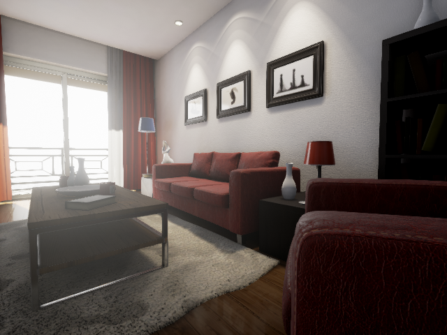

This is the first post of [my series of survey posts](../survey_of_synthesis_cv) on synthesis ways to produce datasets for computer vision or virtual environment for DL/RL. Today we will have a look at a pretty neat tool -- [unrealcv](https://github.com/unrealcv/unrealcv) to acquire data from the Unreal4 world.
<!-- more --> 
In this post, you will discover:

* how to install `unrealcv` to your computer
* how to use the command interactively in [RealisticRendering](http://unrealcv.org/reference/model_zoo.html#realistic_rendering) map
* how to use python code to fetch data

Note: The [official website](http://unrealcv.org/) is pretty nice organized and you're encouraged to read their document there or [a more rich official version](http://docs.unrealcv.org/en/master/). I record these things here just to make my series thorough and organized.

# Intro

>UnrealCV is a project to help computer vision researchers build virtual worlds using Unreal Engine 4 (UE4) <br>
-- Gitbub of unrealcv

# Features

Before all, let us think what data we really need, for computer vision applications, we need:

* at least one camera
* the camera can be adjusted by providing the $\mathbf{R}$ and $\mathbf{t}$
* the original image data, the normal, the mask, better if can get depth image
* the objects number, name, color


The `unrealcv` meets all these common requirements and even more, see figure @fig:unrealcv_help.

{#fig:unrealcv_help width=50%}


# Let us have a try!

You are also encouraged to see official [getting_started](http://unrealcv.org/tutorial/getting_started.html).

1. Download the extended version of [RealisticRendering](http://unrealcv.org/reference/model_zoo.html#realistic_rendering) for your platform
2. Unzip and run the binary.
3. Use mouse to look around and use keys `wasd` to navigate, use qe to level the camera up and down, use `←↑→↓` to control the rotation of the camera.(Seem that `←→` do the `yaw` rotation well but `↑↓` is somewhat wired -- not `pitch` nor `roll`, but it's OK)
4. Type **`** (the key on top of tab) to release the mouse and thus enter command line environment, type it twice to show enlarged command graphical interface.
5. Type `vget /camera/0/lit` and navigate to the folder `RealisticRendering\Binaries\Win64`, we can see the `00000001.png` we just captured. You should get something like figure @fig:first_capture
6. Type `vget /unrealcv/help` will get something like our first figure.
7. TRY COMMANDS LISTED IN HELP

Note: In Windows, chances are that you will encounter `DirectX Runtime` problem when trying to run the binary file, just download something like `DirectX Repair V2.1` and repair the lacked files.

{#fig:first_capture width=50%}

# Show me the code, please!

We want to get tons of thousands images from the virtual environment and then use them in various ways. So, we need codes to do that, and TES, we can do that! To use code fetch images via unrealcv is ***unreally easy***:). See code snippet below (or just <br>`wget https://raw.githubusercontent.com/unrealcv/unrealcv/master/client/python/demo.py . --no-check-certificate`):

``` python
from unrealcv import client
client.connect() # Connect to the game
if not client.isconnected(): # Check if the connection is successfully established
    print 'UnrealCV server is not running. Run the game from http://unrealcv.github.io first.'
else:
    filename = client.request('vget /camera/0/lit')
    print 'Image is saved to %s' % filename
    for gt_type in ['normal', 'object_mask']:
        filename = client.request('vget /camera/0/%s' % gt_type)
        print '%s is saved to %s' % (gt_type, filename)
    filename = client.request('vget /camera/0/depth depth.exr')
    print 'depth is saved to %s' % filename
    # Depth needs to be saved to HDR image to ensure numerical accuracy
```


The code is pretty straightforward, we will get these files in a very short time. (Still in `RealisticRendering\Binaries\Win64` folder)

Note: The python version is version 2.x.x, and `pip install unrealcv` before typing `python demo.py`, and remember to launch the binary file first to start the game!

# Could it be better

For me, It would be better if we can get:

* distance of specific object from the camera or between objects (calculate from the depth image can lose accuracy (intuitive feeling) and not easy as a function call)


# Conclusion

Today, we tried to install the `unrealcv` and use it both in the interactive mode and programming mode (python).

What we did not cover is setting the camera position and rotation in the code, move the camera and fetch new images there, which is essential when getting images dataset.

And, we are using the RealisticRendering virtual environment all the time, in practice usage, we need to create our own world and thus need to do some programming with Unreal Engine. Will talk about latter (hopefully won't be too long). And you can see [unrealcv/playground](https://github.com/unrealcv/playground) before my coming post covering that.

