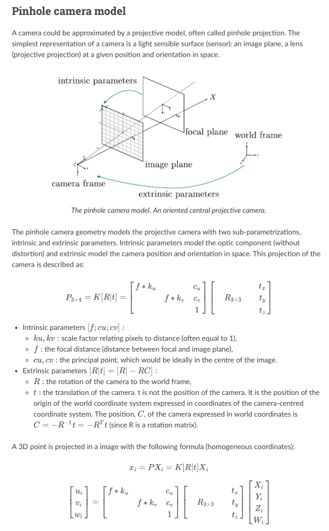
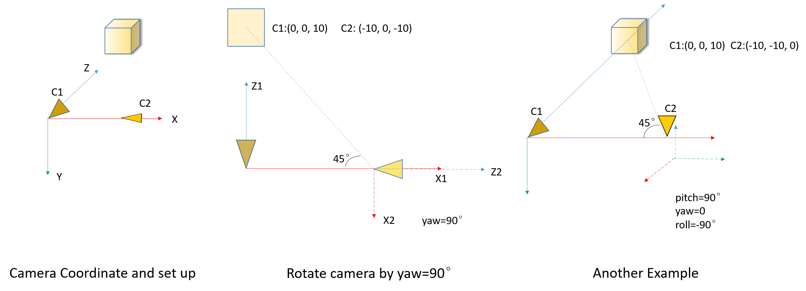
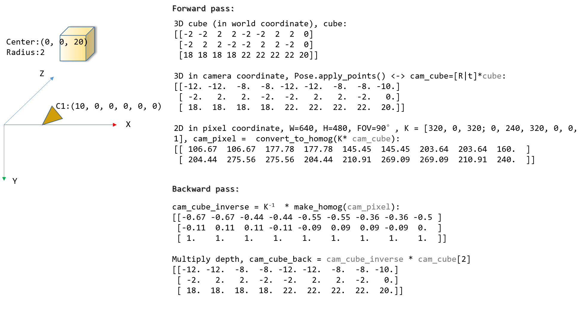

Camera pose estimation is one of the most widely used low-level computer vision research, fundamentally supports SLAM, SfM, AR, VR and our ACR (Active Camera Relocalization).

For one camera, we can express its pose by its location and rotation w.r.t. to one global coordinate, and for relative pose between two images, we can treat one as the global and assign $I=[eye(3);0]$ to it. But this kind of `intuitive` description/assignment is not clear enough at all, especially when you try to code it (believe me -.-).

<!-- more -->

For example, the location can be `Camera in global coordinate` or `Global origin in camera coordinate`, and same for rotation, `Rotate from the global origin to the camera` or `to the origin`, let alone these sentences like `Recover relative camera rotation and translation from an estimated essential matrix and the corresponding points in two images` (in OpenCV recoverPose function doc). Maybe you chose one of the four combination and try to stick to it, but latter found that it not the choice your underlying library chose, which is rather frustrating.

In this post, we try to specify one definition of **`POSE`** and its $R,t$ parts and their physical meaning. Which are adopted by both OpenCV and OpenMVG (and maybe many others but not clearly stated), and with python code as demonstration.

## Camera Model

Almost all literature use the very same pinhole camera model[^opencv_cam_m],[^openmvg_cam_m], like in Fig \ref{pinhole}.

[^opencv_cam_m]:https://docs.opencv.org/2.4/modules/calib3d/doc/camera_calibration_and_3d_reconstruction.html

[^openmvg_cam_m]:https://openmvg.readthedocs.io/en/latest/openMVG/cameras/cameras/

{#pinhole width=85%}

## Pose and R, t

> Output rotation vector (see Rodrigues ) that, together with tvec , brings points from the model coordinate system to the camera coordinate system.  -- OpenCV solvePnP/solvePnPRansac doc.

And, 
> R: the rotation of the camera to the world frame,  
t: the translation of the camera. t is not the position of the camera. It is the position of the origin of the world coordinate system expressed in coordinates of the camera-centred coordinate system. The position, C, of the camera expressed in world coordinates is $C=−R^{−1}t=−R^Tt$ (since R is a rotation matrix).  
--[OpenMVG Camera Model](https://openmvg.readthedocs.io/en/latest/openMVG/cameras/cameras/)

So, both the documents are saying the same thing, the camera `POSE` will **bring point in world coordinate into camera coordinate**. a.k.a:

$Pose=[R|t]=[R|-RC]$ and $p_{camera} = Pose * p_{world}$,

And that's it, please read the OpenMVG statements again, the physical meanings of $R, t$ and $C$ are defined explicitly as stated.

One major counterintuitive part is the $R$, most of the time we rotate camera from origin by three Euler angle in one particular sequence, however, the $R$ in pose means `the rotation of the camera to the world frame`, so, inverse of our common rotating.

## Experiments

We demonstrate with `Pose3` module from OpenMVG[^mvg_pose3], by converting it into python[^acr_pose].

We set up one cube in 3D world, change the location and rotation (pose) of camera, project the cube into camera coordinate and 2D pixel. Showing that $Pose, R, t, C$ do satisfy former statements.

Then we do relative pose estimation with OpenCV's `findHomography, findFundamentalMat, findEssentialMat, recoverPose, and solvePnPRansac` and show that the API are pretty straightforward to use.

### 3D CUBE

{#rotatation width=75%}

Fig \ref{rotatation} gives two example of camera pose change, we rotate camera by predefined sequence (pitch, yaw then roll), but when calculating, use the `inverse` to make sure the rotation from camera to world frame. Codes are:

We use 90° for visual convenience, for another example: if we rotate camera by $R_{w2c}=(pitch=10°, yaw=20°, roll=30°)$, then $R_{c2w}=R_{w2c}^T=(pitch=-19.01°, yaw=-11.82°, roll=-33.75°)$, which means we need to rotate the camera by completely another Euler angle (not just minus or so) to get the camera back. And of course, if we rotate by roll/yaw/pitch (the inverse) sequence, the angles are exactly minus, which should be easy to understand.

### 3D CUBE and projection

Let's push it further by projecting more points and using them for camera pose estimation.

{#forward_backward width=85%}

`findHomography, findFundamentalMat, findEssentialMat+recoverPose, solvePnPRansac` are relative pose estimation methods provided by OpenCV.

Table: Relative pose estimation in OpenCV \label{tbl:data_type}

| Method | Input_A | Input_B | Constraints |
| - | - | - | - |
| findHomography | 2D pixel of 3D **plane** | $\Leftarrow$ | $s_i [p2;1] \sim H [p1;1]$, $s_i$ is scale |
| findFundamentalMat | 2D pixel of 3D object | $\Leftarrow$  | $[p2;1]^T F [p1;1]=0$ | 
| findEssentialMat | 2D pixel of 3D object | $\Leftarrow$ | $[p2;1]^T K^{-T} E K^{-1} [p1;1]=0$ | 
| recoverPose |  |  | $P_B \simeq RP*P_A$   $\bar{t}$ is normalized, only has direction |
| recoverPose | 3D object | 2D pixel of 3D object | $P_B = RP*P_A$ |

The take away is all APIs are constant, a.k.a: POSE= [R|t] = METHOD(A, B) will bring A to B -> $P_B = POSE * P_A$.

## Summary

In this post, we try to specify the characteristics and physical meanings of **POSE, R, t, C**, which are widely used in low-level computer vision tasks. In conclusion:

* POSE: bring point in world coordinate into camera coordinate;
* R: the rotation of the camera **to** the world frame;
* t: the position of the origin of the world coordinate system expressed in coordinates of the camera-centred coordinate system;
* C: the camera expressed in world coordinates.

And as one reminder, when we manipulating cameras, most of the time we say rotation from the point of view of the camera, like, in ACR, after calculating relative pose, we rotate the three Euler angle, which is okay. But in some scenarios, like the UnrealCV virtual environment, we are actually setting the camera rotation by API, such like `vset /rotation/pitch=x,yaw=y,roll=z`, that is, we can always and only rotate the camera **from** the world coordinate, no other way around.

Say we want to capture image at pose of $[R|C]$, $C$ is rather clear (set the location of camera), but $R$ in pose should be inversed so that we can rotate the camera from origin. And after pose estimation, the very same procedure, $R_{new}=Relative\_Pose * R$, inverse $R_{new}$ for camera rotating.

That's it.

