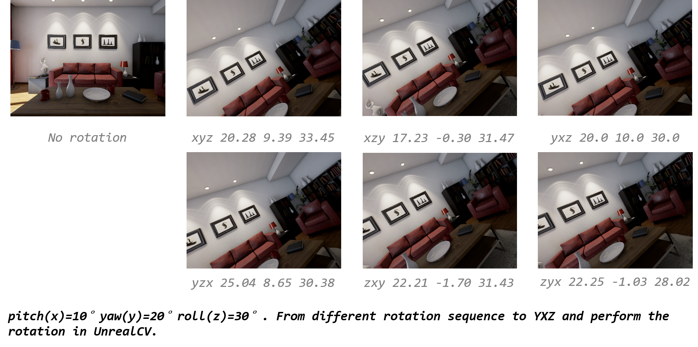

> 3D rotations matrices can make your head spin. I know it is a bad pun but truth can sometimes be very punny! -- [https://www.learnopencv.com/rotation-matrix-to-euler-angles/](https://www.learnopencv.com/rotation-matrix-to-euler-angles/)

It has always been a burden to understand the physical meaning of euler angle and do the rotation manipulation in code right, for a really long time. Each and every time I thought I was right and tweaked the codes and latter found that I was wrong in one way or another.

I will try to show how to do Euler angle right, both intuitively and with code. *Hope this time I am right.*

## Euler Sequence matters

> Rotations given as a set of three angles can refer to any of 24 different ways of applying these rotations, or equivalently, 24 conventions for rotation angles. [^transform3d]

[^transform3d]:https://matthew-brett.github.io/transforms3d/reference/transforms3d.euler.html

For example, in `intrinsic` scenario -- the axes move with the rotations, like we rotate one dice. By only rotating around two axis, (X=90°, Y=90°) and (Y=90°, X=90°), we will get totally different pose, as shown in \ref{xy_yx}.

{#xy_yx width=85%}

## Notations we use

In most of our scenarios (camera relocalization workflow for the most time), we rotate cameras a lot, and `intrinsic` representation makes great scene.

There are some other representation of rotations like axis-angle and quaternion, but they are less intuitive in the hardware transformation view. And the rotation matrix are chosen for mathematical manipulating, which is also adopted by OpenCV in their pose estimation functions.

## UnrealCV as an example

We use unrealcv[^unrealcv] extensively for our ACR (Active Camera Relocalizatino), and it alone is one interesting resource for many other computer vision projects.

[^unrealcv]:https://github.com/unrealcv/unrealcv

For rotating the camera as will, we need to find out the sequence of rotation in UnrealCV and do the transformation if necessary. We propose to rotate with rather large angle to find out the rotation sequence in virtual env. E.g. rotate with (X=90°, Y=90°, Z=0), (X=90°, Y=0, Z=90°), (X=0, Y=90°, Z=90°) or (X=90°, Y=90°, Z=90°), with them, we can find the rotation sequence in UnrealCV is YXZ (yaw first, then pitch and roll).

After we get the sequence, for demonstration, as in Fig \ref{rotation_transform}, we transform (pitch(x)=10°, yaw(y)=20°, roll(z)=30°) in different order into YXZ, perform the rotation in UnrealCV and show the captured images as visual clue.

{#rotation_transform width=85%}

So, we need to transform rotation matrix (or one specific Euler sequence) into YXZ for image capturing. And the underlying mechanism stays the same when we choose to do camera rotation in other game engine or hardware.

## Conclusion

Euler angle is one of the representation of 3D rotation, and pretty intuitive one. However, the sequence of Euler angle makes great difference, we need to figure out the right sequence before using it. And it makes no good to just `GUESS` and see how the result comes -- which we did a lot when implementing ACR at first. Codes designed carefully should be better than tweaked one.