The intrinsic of camera matters a lot in many low-level computer vision tasks, and in many scenarios maybe one plausive configuration is enough, there is no needs to get exact value. In this post, we demonstrate how to get camera intrinsic quickly with unavoidable error.

<!-- more -->

## Comments on github issue:

> The focal length f = W / 2 / tan(FOV/2) = W/2, where W is the width of the image which is 640 px here. And the pixels are square. [https://github.com/unrealcv/unrealcv/issues/14#issuecomment-248554326](https://github.com/unrealcv/unrealcv/issues/14#issuecomment-248554326)

f = W/2 = 320px

## Get f with moving

4.2 Camera Calibration from Programming Computer Vision with Python

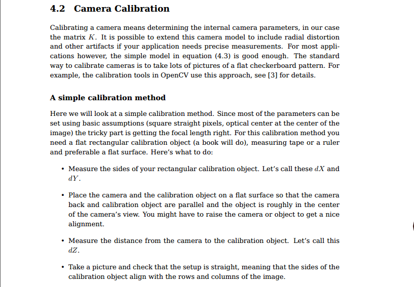
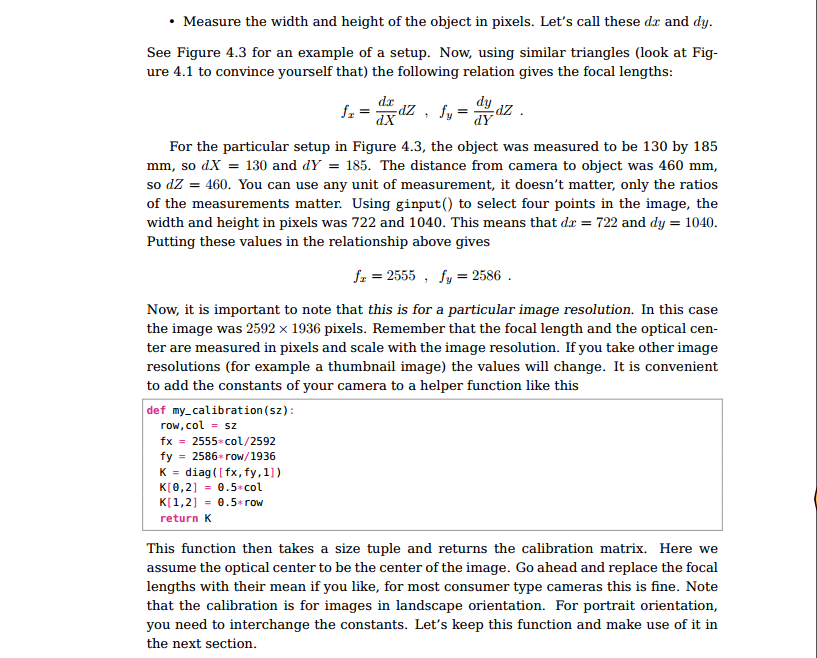
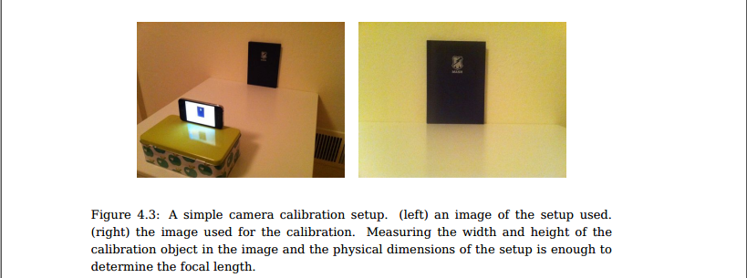

We use similar setup. We shot at one position, the move the camera right/up for certain pixel ($x, y$), measure coordinate change of one certain pixel ($d_x, d_y$) and depth of camera $d_Z$, the get $f_x, f_y$.

$$f_x = \frac{d_x}{x}d_Z$$

In UnrealCV, the coordinate is X(front), Y(right), Z(up). With RealisticRendering, we take three images at (120, -120, 165), (120, -80, 165), (120, -120, 205) with FOV of $90°$ and $60°$. 

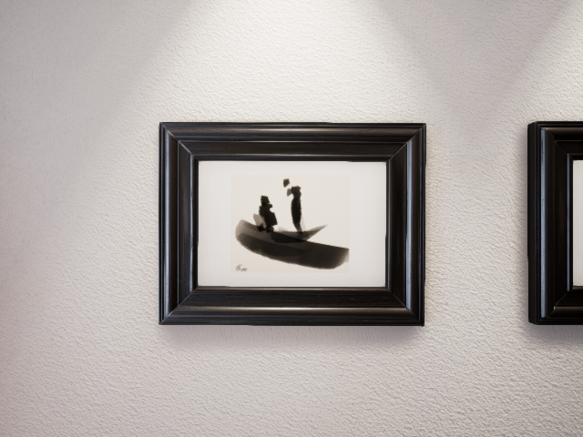
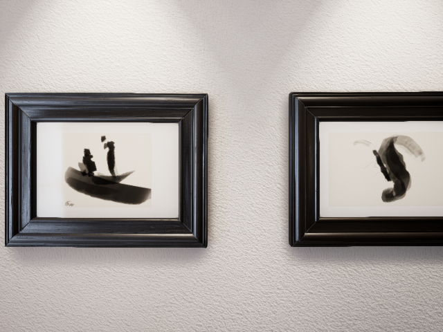
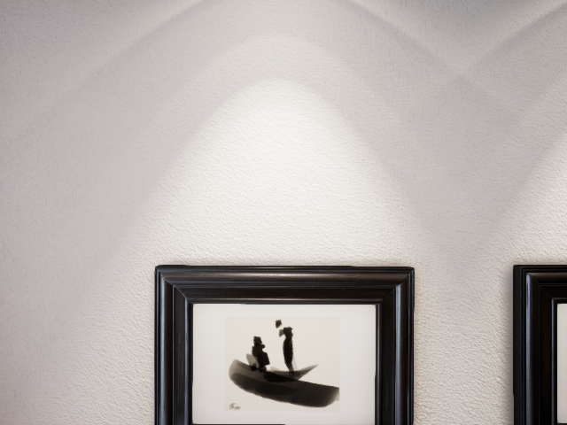
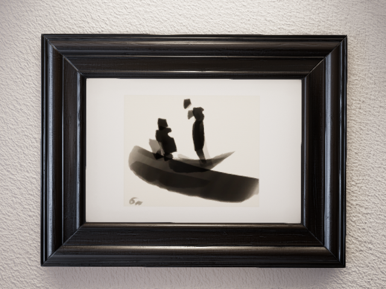

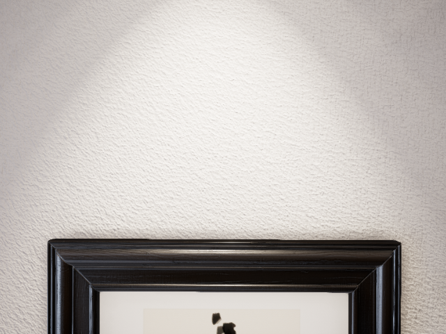

With the head of the right person on the boat, we can get corresponding coordinates:

Table: Corresponding coordinates with different FOV

| Camera Position/FOV | 90 | 60 |
| - | - | - |
| (120, -120, 165) | (311, 197) | (305, 165) |
| (120, -80, 165) | (146, 197) | (19, 165) |
| (120, -120, 205) | (311, 362) | (305, 451) |

### Distance to wall, $d_Z$

So, we need to get $d_Z$, we can try to move the camera, and recognize that when the camera can not see anything, we are at the border, which is where Z (X in UnrealCV) = 198, then $d_Z=198-120=78$.

However, we can also get $d_Z$ by moving the camera.

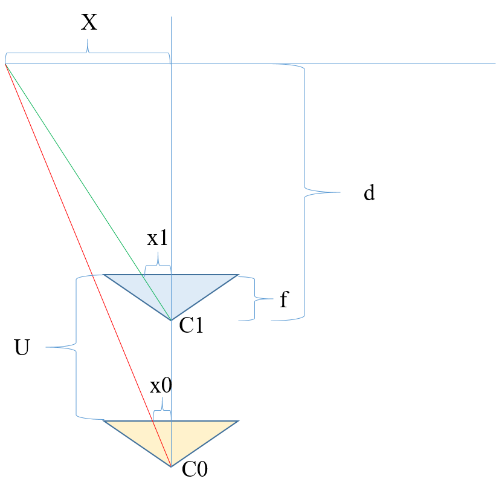

We can move forward for certain distance $U$, with $\frac{X}{x_0}=\frac{d+U}{f}$ and $\frac{X}{x_1}=\frac{d}{f}$. 

Table: Corresponding coordinates with different FOV, the latter one of each item is distance to camera center.

| Camera Position/FOV | 90 | 60 |
| - | - | - |
| (120, -120, 165) | (311, 197), (-9, -43)=43.93 | (305, 165), (-15, -75)=76.49 |
| (80, -120, 165) | (314, 212), (-6, -28)=28.64 | (310, 191), (-10, -49)=50.01 |

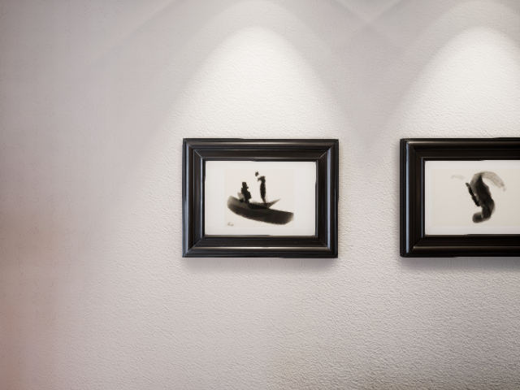
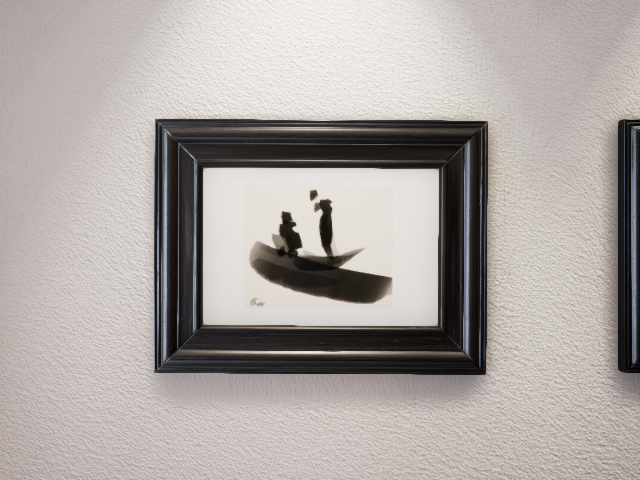

So, with FOV=90°, $\frac{X}{28.64}=\frac{d+40}{f} and \frac{X}{43.93}=\frac{d}{f}$, we have d=74.92,
with FOV=60°, $\frac{X}{50.01}=\frac{d+40}{f} and \frac{X}{76.49}=\frac{d}{f}$, we have d=75.54.

Then, $d_Z=75$, the difference with $78$ is not that big.

### Back to $f$

For FOV=90°, $d_x=311-146=165, x=120-80=40$, $f_x =\frac{d_x}{x}d_Z=\frac{165}{40}78=321.75$. $d_y=362-197=165, y=205-165=40$, $f_y =\frac{d_y}{y}d_Z=\frac{165}{40}78=321.75$. 

For FOV=60°, $d_x=305-19=286, x=120-80=40$, $f_x =\frac{d_x}{x}d_Z=\frac{286}{40}78=557.7$. $d_y=451-165=286, y=205-165=40$, $f_y =\frac{d_y}{y}d_Z=\frac{286}{40}78=557.7$. 

Back to $f = W/2/tan(FOV/2)$, with FOV=90°, $f=W/2/tan(45°)=640/2/1=320$, with FOV=60°, $f=W/2/tan(30°)=640/2/0.577=554.59$.

So, the results are pretty nice.

## Camera intrinsics

$$
K 
= \begin{bmatrix}
  f_x &  & c_u \\
   & f_x & c_v \\
   &  & 1\\
  \end{bmatrix}
= \begin{bmatrix}
  320 &  & 320 \\
   & 320 & 240 \\
   &  & 1\\
  \end{bmatrix}
= \begin{bmatrix}
  width/2 &  & width/2 \\
   & width/2 & height/2 \\
   &  & 1\\
  \end{bmatrix}
$$

That is it.
